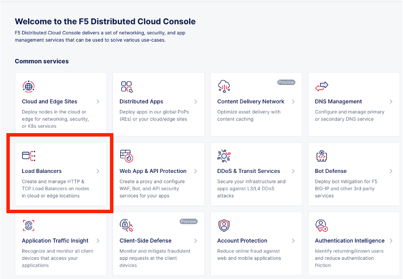
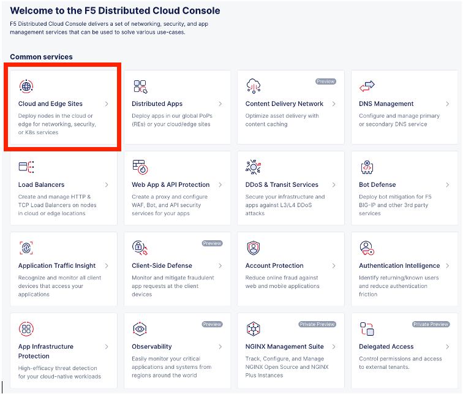
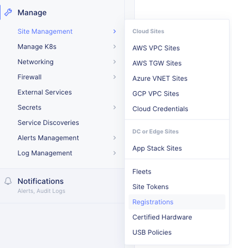
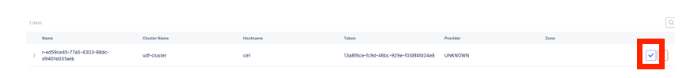
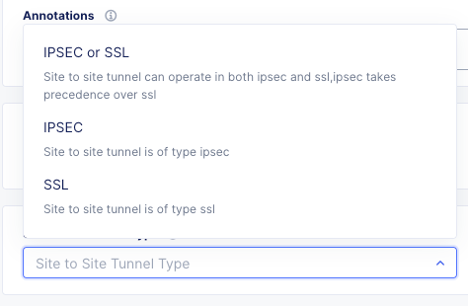
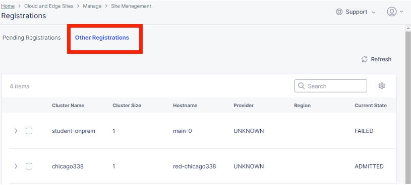
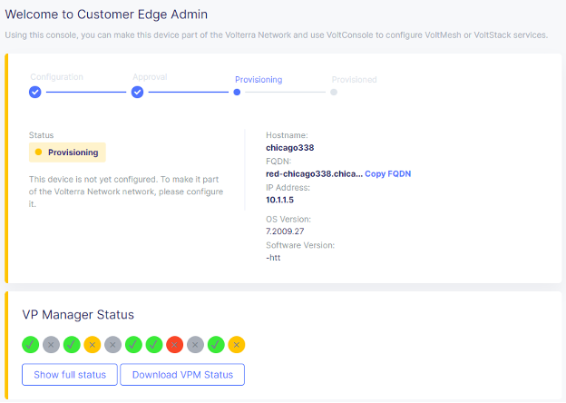
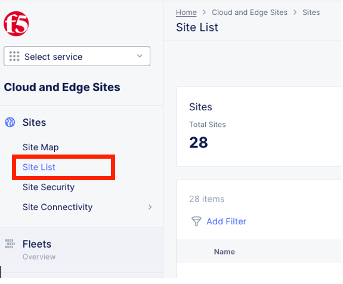
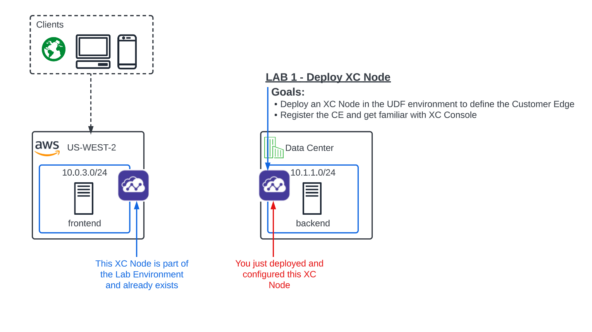
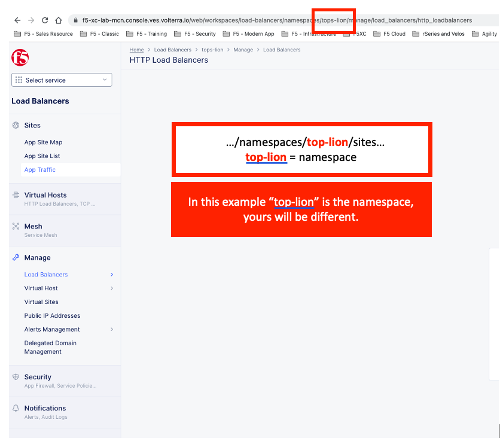

Lab 1: Building an XC Node (CE)
==================================

**Objective:**

*Get familiar with the UDF lab environment. 

*Deploy an XC node to define the Customer Edge at the UDF Data Center (on-prem).

*Explore and become familiar with the Distributed Cloud console.

**Prerequisite**
--------------

.. NOTE:: You should have received an email from F5 Distributed Cloud User Management <no-reply@volterratmails.io> with the content as follows:

.. image:: ../images/updatepasswd.png
 
 
If you have not already, please click on Update Password, and change your credentials. Ensure you adhere to the password strength restrictions and make a mental note of these credentials as you will need them several times throughout the labs today. 

Once you've set your new password you will be presented with the following screen:

.. image:: ../images/tenantlogin.png 

In the domain field, enter: **f5-xc-lab-mcn**, click **Next** and sign in with your email address and password you've just set, and proceed to accepting the Terms and Conditions. 

.. warning:: If you have not received the email to change your credentials or ran into problems changing your credentials, please stop and get help from one of the Lab Assistants. 

**Logging into the XC Console**
---------------------------------

#. After accepting Terms and Conditions, you will need to select your "persona". 

   Enter your persona as "NetOps" and level as "Intermediate".  You can change these settings after logging in as well.

   Your persona will highlight workflows within F5 Distributed Cloud.  You will be able to access all services, but making use of
   personas can focus your view on particular tasks that are relevant to your role.

#. Click on **"Account Settings"** by expanding the **"Account"** icon in the top right of the screen and 
   clicking on **"Account Settings".**  In the resulting window you can observe the **Work domains and skill level** section and 
   other administrative functions.
   
.. note::
   *For the purposes of this lab, permissions have been restricted to lab operations.  As some menus will be locked and not visible.*

|intro006|

|intro007|

**Find your Namespace**
---------------------------------

#. Namespaces, which provide an environment for isolating configured applications or enforcing role-based access controls, are leveraged
   within the F5 Distributed Cloud Console.  For the purposes of this lab, each lab attendee has been provided a unique **namespace** which
   you will be defaulted to (in terms of GUI navigation) for all tasks performed through the course of this lab.

#. Click on **Load Balancers** from the main dashboard under Common Services.

3. In the **Load Balancers** configuration screen observe the URL. In the URI path, locate the **<adjective-animal>** namespace that you have
   been assigned. It will be located in the portion of the URI path between */namespaces/* and */sites/* as shown in this example 
   **…/namespaces/<namespace>/sites/…**. Note your namespace as it will be used throughout the lab tasks that follow.

.. warning:: If you have problems locating your namespace, please see a lab assistance.

|intro009|                                                                                   |

.. note:: Administratively, there are other ways to find namespaces. Due to access and permission restrictions for this particular lab, those menus are not available.

**Site Token**
----------------

Soon, you will be standing up an XC Node in the udf lab environment (on-prem dc) that will need a way to register itself to the Distributed Cloud Infrastructure and associate it with your tenant. To do this you will need a Site Token. 

If you are not already logged into the console, please do so now by opening the following URL in your browser: 

https://f5-xc-lab-mcn.console.ves.volterra.io/

Click on **Cloud and Edge Sites**

Alternatively, if you’re already logged into Distributed Cloud

1. Click on the Select Service in the left-hand navigation. Click on Cloud and Edge Sites 
  
  .. image:: ../images/cloudandedge2.png 

2. On the side menu go down to Manage, then select **Site Management > Site Tokens**
    
3. In the lab we have generated a Site Token for you to use named **student-ce-site**.  
In your production environment you will need to create your own Site Token to register your Customer Edge node.  

  .. image:: ../images/tokens.png 

4. Copy the UID of the the **student-ce-site** token and paste if somewhere you can reference later (word, notepad etc)

**Setting up the Customer Edge**
----------------------------------

In your browser, you should have a tab open to the UDF course. Under the F5 Distributed Cloud CE, click on **Access-->Site UI**

.. image:: ../images/udf-ce.png 

This should prompt you for authentication and then open the Customer Edge node Admin portal.

Type in the default username/password:

==============================  =====
Variable                        Value
==============================  =====
Default Username:                **admin**
Default Password:                **Volterra123**
==============================  =====

.. image:: ../images/signin.png 

You will be prompted to change the password at the initial log in. **Make a mental note of these credentials as you will need them several times throughout the labs today.** 

.. image:: ../images/changepwd.png

After you set the password, the services will need to restart and then the Customer Edge node will present the Dashboard

.. image:: ../images/restart.png 

Once all services are up and running you should see the Dashboard:

.. image:: ../images/dash.png 

You will notice the XC Node is not configured yet.  Also notice the VP Manager Status.  If you mouse-over each of the icons, the specific services will report their status in addition to the status reflected by the icon.

Mouse over each of the components under VP Manager Status and note the components and their condition.  You can also click on “Show full status” and see a JSON report that is used to present the VP Manager Status.

You can also scroll down and see hardware details that describe the platform that the Customer Edge is installed on. 

Click **Configure Now**

.. image:: ../images/ceconf.png 

This will take you to the Customer Edge Device Configuration page.

Set the following parameters and leave everything as default.

==============================  =====
Variable                        Value
==============================  =====
Token                           Insert the Site Token UID you collected earlier
Cluster Name                    Insert your unique namespace <verb, animal>
Hostname                        Insert your unique namespace <verb, animal> 
Latitude                        33.812
Longitude                       -117.91
==============================  =====

The end result should look like the image below, and then click **Save Configuration.**

.. image:: ../images/devconf.png 

After you save the configuration, you will be taken back to the Dashboard, notice the status change to **“Approval”.**

.. image:: ../images/approval.png 

**You can safely ignore this benign warning due to the UDF lab environment.**

.. image:: ../images/error.png 

We will now go accept the Customer Edge registration in Distributed Cloud console. 

**Registering the Customer Edge**
----------------------------------

Go back to the Distributed Cloud console.  If the session timed out, you will need to log back into the console using the following URL or refreshing your browser:

https://f5-xc-lab-mcn.console.ves.volterra.io/

From the **Select Service menu** click on **Cloud and Edge sites**.

On the side menu go down to **Manage>>Site Management>>Registrations.**

The Customer Edge node you configured from the previous step should appear on this list, if not give it a couple minutes and refresh the screen by clicking the Refresh button at the top right-hand corner.  

.. Tip:: This process can take a few minutes for the node to register with Distributed Cloud. 

Once the node appears in the Registration list, accept the registration of the node by clicking on the blue check mark.  You can also decommission the node if you feel there’s an error with the settings by clicking the red X. 

Click the blue check mark to accept the registration. 

.. Note::  If you DO NOT see a blue check mark, its likely your browser width is NOT wide enough.  Simply increase the width of the browser and you should see the blue checkmark to approve the registration.

This will bring up the Registration Acceptance menu which shows all the settings of the Customer Edge node.  Note the parameters you’ve entered from the previous exercise are pre-populated into the appropriate fields. 

.. Important:: Look at the Cluster Size parameter and notice this is set to 1.  In this lab, we will only deploy a single node cluster and thus leave this setting as 1.  In a production environment, the best practice is to deploy a 3-node cluster minimum.  In that case, the Cluster Size parameter would be set to 3 so an appropriately sized cluster can be formed.

**Leave the cluster size set to 1**

.. image:: ../images/clustersize.png

Scroll down to Site to Site Tunnel Type and click on the drop down arrow

.. image:: ../images/s2sarrow.png

Select IPSEC or SSL from the list.  This setting is what determines the connectivity method used for the mesh. THe XC Node will form autamatically bring up redundant tunnels to two different Regional Edges. 
These tunnels are self-healing and can fallback when using the configuration setting of IPSEC or SSL VPN.

Click **Save and Exit**. 

Once the registration completes, you can see the cluster in the “Other Registrations” tab and the current state will be ADMITTED.

The Customer Edge Node Admin portal will also reflect some changes in its status, although the node still requires some additional configuration

In the Distributed Cloud console, once the Node has been Admitted, click on Site List under Cloud and Edge Sites at the top left hand corner. 

You should see the CE you just deployed on this list. 

.. Note:: This step takes about 10 -15 minutes to complete and will finish up while we start our presentation and lecture. 

Observe the different **Site Admin State, Health Score, and Software Version and OS version.**

.. image:: ../images/prov1.pngFIX

The Node will go through what we call the provisioning process, where the latest Software version will be installed. You can see that by looking at the status under the SW Version. You may also observe the Health score going up and down as services are spun up and restarted. 

The end result should look something like the following screen where the node is green at 100 percent health and have the latest software version have a successful status. 

.. image:: ../images/prov3.pngFIX

Sanity Check
-------------
**This is what you just deployed.**

**End of Lab 1**

.. |intro006| image:: ../images/intro-006.png
   :width: 800px
.. |intro007| image:: ../images/intro-007.png
   :width: 800px

