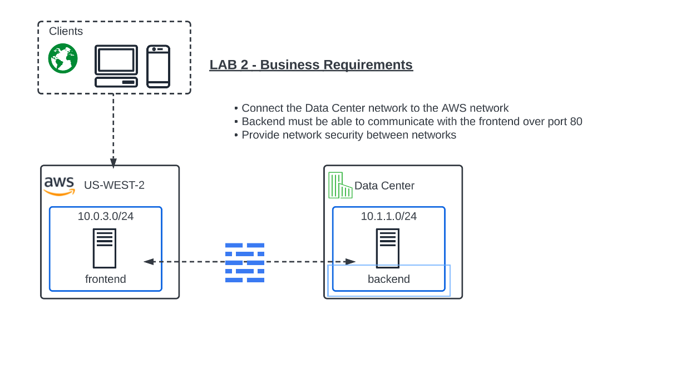
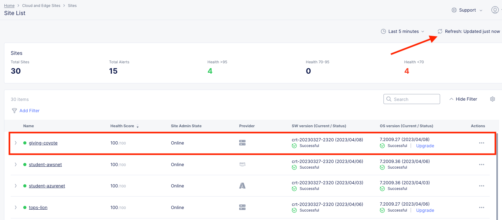
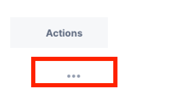
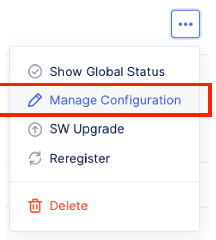
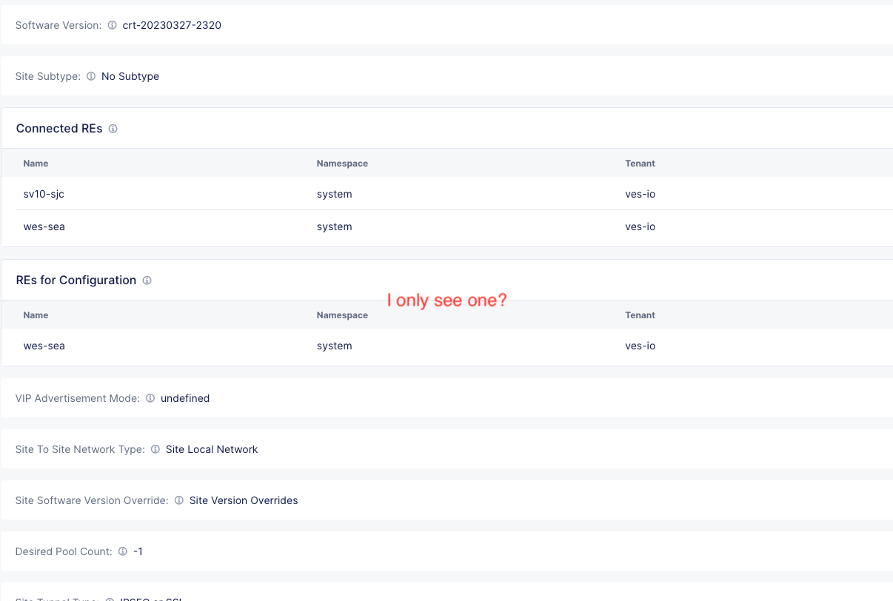
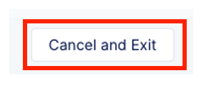
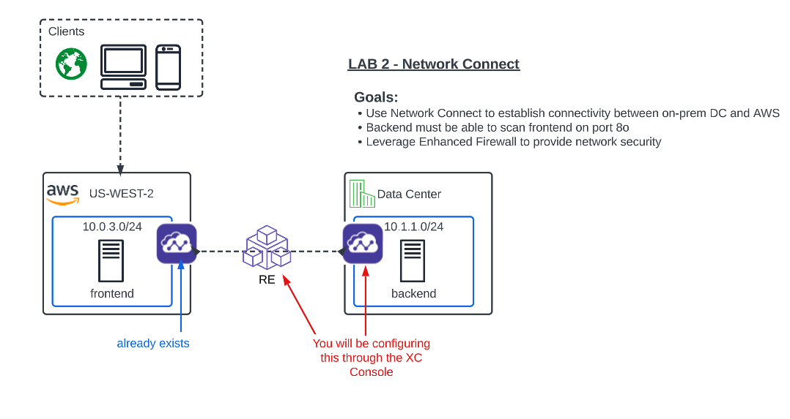

Lab 2: Configuring Network Connect (L3/L4 Routing Firewall )
=============================================================

**Objective:**

*Verify the XC Nodes health. 

*Configure Network Connect to connect the Data Center networkto the AWS Network.

*Test connectivity and configure Enhance Firewall for network security

*Review network security events in the XC console.

**Narrative:** 
Now that your XC Node is provisioned, it's time to verify, explore the XC Console and set up Network Connect to establish secure connectivity between the Data Center and AWS networks. 
After the setup is complete, you will test connectivity and verify network security. 

Verify the XC Node health
---------------------------------------

If you are not already logged into the console, please do so now by opening the following URL in your browser: 

https://f5-xc-lab-mcn.console.ves.volterra.io/

From the **Select service** menu, click on **Multi-CLoud Network Connect** and then click on **Site List,**

Your the XC Node should have registered successfully and will appear green with a Health Score of 100. You may need to click **Refresh** in the top right corner
if you do not see your animal name. 

Also note the current **Site Admin State, Provider, SW version, and OS version.**

Click on the three dots under Actions at the far right of the screen of "your animal"  Customer Edge.

Click on Manage Configuration

Notice the Metadata, Site Type and Coordinates fields.  
Most importantly, look at the Connected REs (Regional Edge) section.  

Which Regional Edge sites did the Customer Edge form an IP Sec Tunnel with?  
Why were these two Regional Edge selected?  

These are the closest Regional Edge sites based on the latitude and longitude information provided during the deployment process.

Look at the top left-hand corner where you see Form, Documentation and JSON. You will see this throughout the Distributed Cloud console configuration menus. 
Distributed Cloud is built with an API-first strategy. All the configurations can be done via GUI or API calls. You can view the JSON file of the configuration by clicking JSON. 

**Click on JSON**

.. image:: ../images/json.png

This is the JSON code of the configuration.  You could save this JSON file and create a backup of the Customer Edge configuration but that is beyond the scope of this lab. 

.. image:: ../images/json1.png

Click on Documentation

.. image:: ../images/docu.png

This will load the API specification for a Customer Edge Node. Scroll down and explore the different API options. 

.. Important:: Distributed Cloud is developed with an API first methodology. Everything can be done via API. 

.. image:: ../images/sitev.png

When you are done exploring click on the Cancel and Exit button at the bottom left-hand corner

In the **Site List** screen, click on your Customer Edge Node **animal name**.  The default landing is Dashboard which gives you a summary of the Customer Edge Node.  Note the menus at the top of the screen

.. image:: ../images/dash1.png

Configuring Network Connect
---------------------------------------

Now that you are familiar with your new software defined Node we can start getting our hands dirty with the real configuration necessary to meet ACME companies first requirement to
get the network in the Data Center connected to the network in AWS. The backend security device will need to "scan" the frontend in AWS on port 80. 

In our lab today, an Ubuntu Server in the UDF environment will simulate the backend. 
The AWS front end is already deployed along with an XC Node to extend the Customer Edge in the cloud. 

What you have done so far is setup the ACME Data Center XC Node to extend the Data Center Customer Edge. 
Your first goal is to simply establish routing between these environments by using a hub and spoke model with our Regional Edges as shown in the diagram above.

[INSERT LeeAnn Documentation]

Sanity Check
-------------
**This is what you just deployed.**

**End of Lab 1**

