Lab 2: Configuring Network Connect (L3/L4 Routing Firewall )
=============================================================

**Objective:**

*Verify the XC Nodes health. 

*Configure Network Connect to connect the Data Center networkto the AWS Network.

*Test connectivity and configure Enhance Firewall for network security

*Review network security events in the XC console.

**Narrative:** 
Now that your XC Node is provisioned, it's time to verify, explore the XC Console and set up Network Connect to establish secure connectivity between the Data Center and AWS networks. 
After the setup is complete, you will test connectivity and verify network security. 

.. image:: ../images/lab2biz.png

Verify the XC Node health
---------------------------------------

If you are not already logged into the console, please do so now by opening the following URL in your browser: 

https://f5-xc-lab-mcn.console.ves.volterra.io/

From the **Select service** menu, click on **Multi-Cloud Network Connect** and then click on **Site List,**

Your XC Node should have registered successfully and will appear green with a Health Score of 100. You may need to click **Refresh** in the top right corner
if you do not see your animal name. 

.. image:: ../images/registeredce.png
    

.. Important:: If you do not see your Site as registered or in a healthy state please see a Lab Assistant.
    
From this dashboard you can note the current **Site Admin State, Provider, SW version, and OS version.** 

**Please DO NOT click "Upgrade" on any of the Sites!**

Instead, **Click** on the three dots under the **Actions** column at the far right of the screen of **"your animal"**  Site and click on **Manage Configuration**. 

In this example I was assigned **rested-tiger**.

.. image:: ../images/action.png
    

Review the **Metadata, Site Type** and **Coordinates** fields as well as the **Connected REs** (Regional Edge) section.  

These are the closest Regional Edge sites based on the latitude and longitude information provided during the deployment process. **Each CE has an auto-provisioned self-healing secure tunnel to redundant RE's.** 

.. image:: ../images/remeta.png

Look at the top left-hand corner where you see Form, Documentation and JSON. **You will see this throughout the Distributed Cloud console configuration menus.**

.. Important:: Distributed Cloud is built with an API-first strategy. All the configurations can be done via GUI or API calls. 

You can view the JSON file of the configuration by clicking **JSON**. 

.. image:: ../images/json.png

This is the JSON code of the configuration which could be saved to create a backup of the Customer Edge configuration, but that is beyond the scope of this lab. 

.. image:: ../images/json1.png

Click on **Documentation**.

.. image:: ../images/docu.png

This will load the API specification for a Customer Edge Node. Scroll down and explore the different API options. 

.. image:: ../images/sitev.png

When you are done exploring, click on the **Cancel and Exit** button at the bottom left-hand corner.

.. image:: ../images/cancel.png

In the **Site List** screen, click on your Customer Edge Node **animal name**.  

The default landing is a Dashboard giving you a summary of the Customer Edge Node.  **Note the menus at the top of the screen.**

.. image:: ../images/dash1.png

**Everytbing looks great at this point! Let's get those networks connected with F5 Distributed Cloud Network Connect!!

Configuring Network Connect
---------------------------------------

Now that you are familiar with your new software defined Node we can start getting our hands dirty with the real configuration necessary to meet ACME companies first requirement to
get the network in the Data Center connected to the network in AWS. The backend security device will need to "scan" the frontend in AWS on port 80. 

In our lab today, an Ubuntu Server in the UDF environment will simulate the backend. 
The AWS front end is already deployed along with an XC Node to extend the Customer Edge in the cloud. 

.. image:: ../images/netconnlab.png

What you have done so far is setup the ACME Data Center XC Node to extend the Data Center Customer Edge. 
Your next goal is to simply establish routing between these environments by using a hub and spoke model with our Regional Edges as shown in the diagram above.

**All traffic between these networks will now be routed through auto-provisioned self-healing encrypted tunnels between the defined Custoemr Edges and the XC Regional Edges. 

To connect two or more Distributed Cloud node environments together across the Distributed Cloud network we will need to connect the sites through a Global Virtual Network.  

.. Note:: In this lab some objects are already created due to the single tenant nature of the XC Lab environment. You will still observe and walkthrough the configuration for referrence. 

Creating a Global Network  
--------------------------

Confirm you are still in Cloud and Edge Sites. If not, click on the **Select Service** in the left-hand navigation. Click on **Cloud and Edge Sites**.

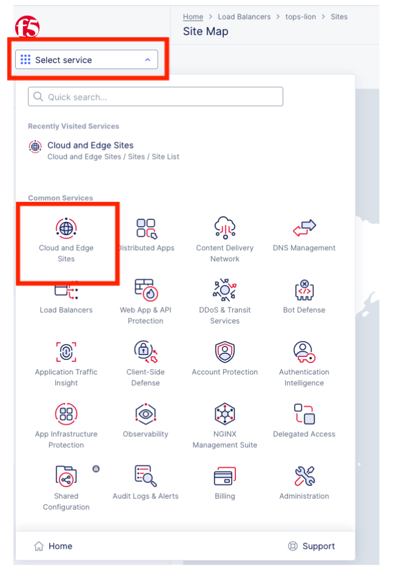

On the left hand side menu go down to **Manage >> Networking >> Virtual Networks**.

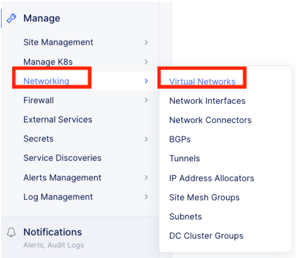

Click on Add Virtual Network at the top menu 

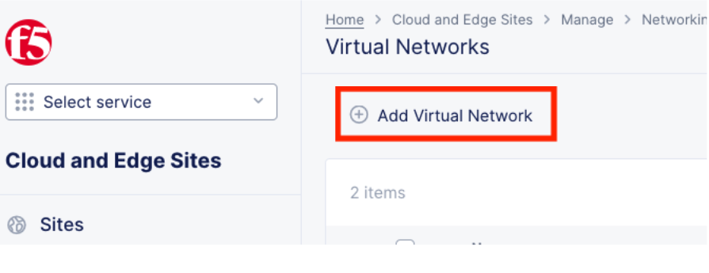

This will open the configuration window for a new virtual network.  

 

Enter a name for the Virtual Network. Please use your namespace (adjustive + animal) follow by global (ex: tops-lion-global) 

Go to Virtual Network Type > click on the drop down arrow > select Global Network  

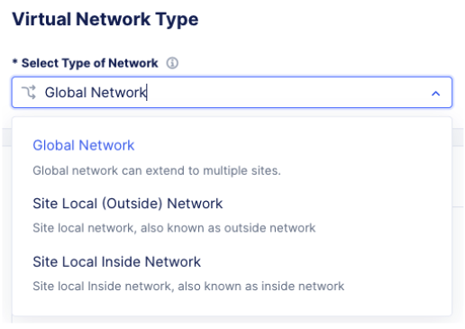

The configuration should look like the screen below, click Save and Exit at the bottom right. 
 

.. image:: ../images/meta.png

Next a fleet is required for eet for on prem nodes. Note: in this lab we have already created a fleet. The following instructions are provided for you to help guide you in your production environment. 

 

A fleet is a collection of network and node objects in a site. When creating a fleet, a fleet_label (required) is created. This label is created in the “Shared” namespace for the tenant. Recall “Shared” namespace is the global settings for a tenant and not the individual namespace. 

Creating a Fleet
------------------

In Multi-Cloud Network Connect context > go down to Manage > Site Management > Fleets 

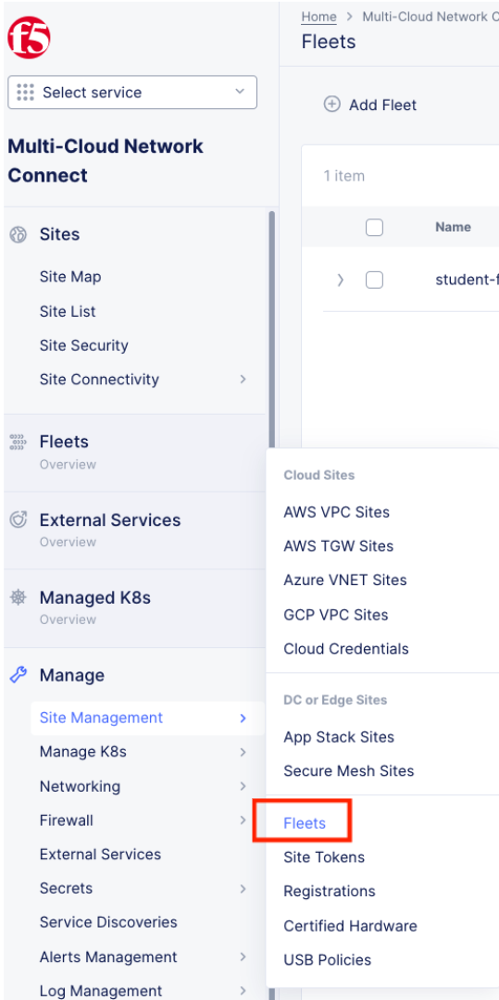

Click on **Add Fleet**.

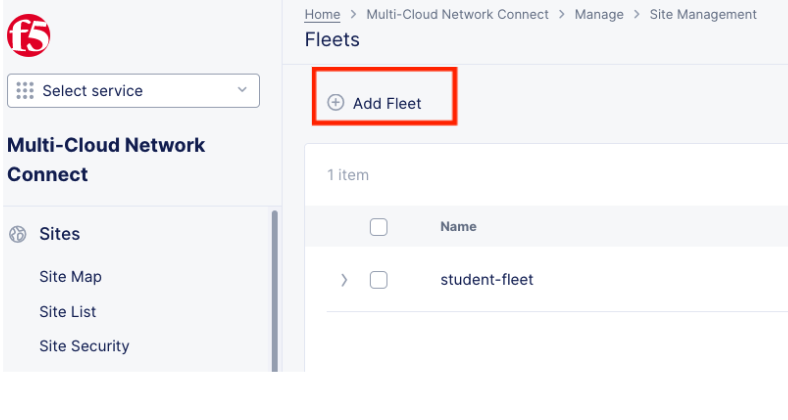

In the fleet configuration, under the Metadata section, enter a Name for the fleet.  

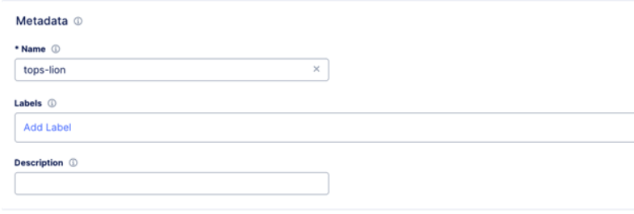

Under the Fleet Configuration section the Enter a label for the Fleet Label Value recall this is the label that’ll be generated and used in the “Shared” namespace of the tenant.  

Also under Fleet Configuation, defines the node Outside (Site Local) Virtual Network and Site Local Inside Virtual Network. These virtual networks points to the node interfaces eth0 aka SLO, and eth1 aka SLI 

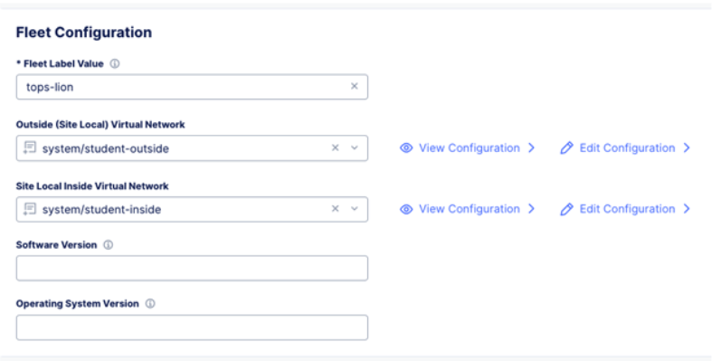

Under the Network Connectors section, select the Global Network created from the previous step 

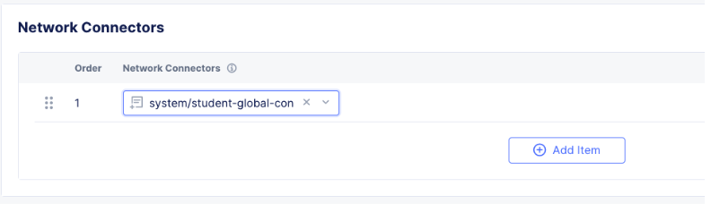

Click Save and Exit 

Previous exercises are key concepts to help you understand some of the components required to establish layer 3 connectivity between nodes. This next part of the lab we will quickly review the settings of the pre-configured Fleet and Virtual Network used in this lab to help establish connectivity.  

Review Virtual Network Config 
--------------------------------------

Click on the **Select Service** in the left-hand navigation. Click on **Cloud and Edge Sites**.

On the left hand side menu go down to Manage > Networking > Virtual Networks 

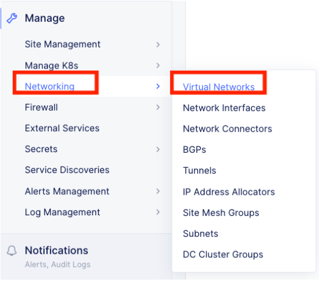

Click on the 3 dots to the far right hand side  student-global  

.. image:: ../images/studglob.png

This will expand the menu, select Manage Configuration  

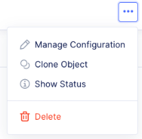

In the next screen click on Edit Configuration  

.. image:: ../images/editconf.png

Observe the configurations for student-global. Note the Virtual Network Type “Global”. This is specify the Virtual Network type will be a connection into F5 Distributed Cloud fabric/ADN. 

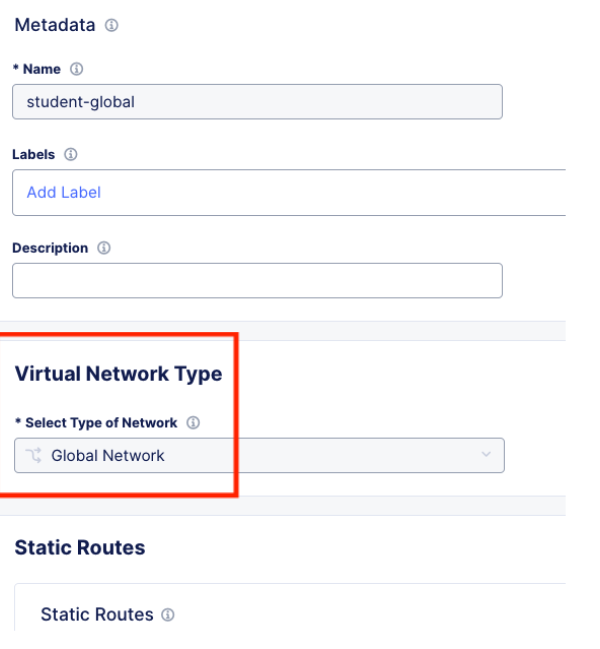

Click Cancel and Exit at the bottom left 

Review Fleet Config
------------------------

In Multi-Cloud Network Connect context > go down to Manage > Site Management > Fleets 

Click on the 3 dots at the far right hand side of student-fleet  

.. image:: ../images/studfleet.png

This will expand the menu, select Manage Configuration  

In the next screen click on Edit Configuration  

Observe the Fleet Configuration and Network Connectors.  

 

Click Cancel and Exit 

Fleet definition on a cloud node 
---------------------------------

On a cloud node (i.e. AWS, Azure, GCP) once a fleet is defined, you will need to add the fleet label to the node. Again in this lab this has already been done for you. We will walk you through how to verify this in Azure node.  

 
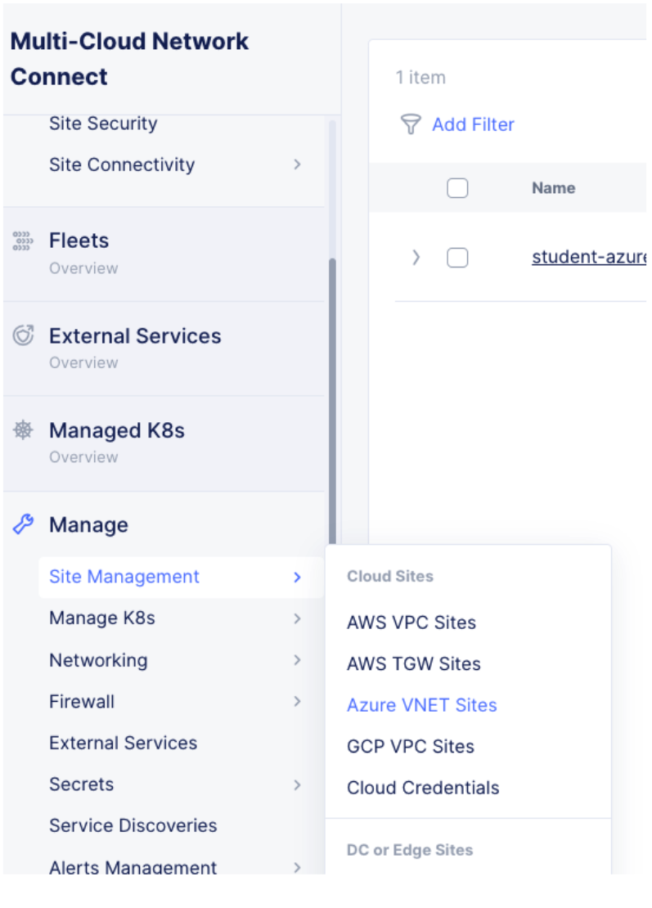

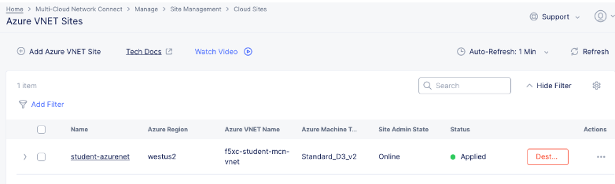

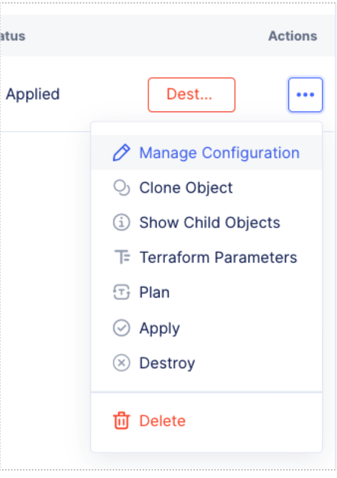

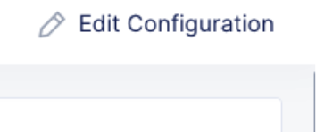

Observe the fleet label  

.. image:: ../images/fleetmeta.png

To Add a fleet to a cloud node in your production environment do the following  

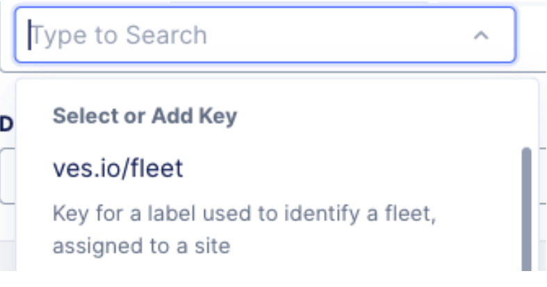

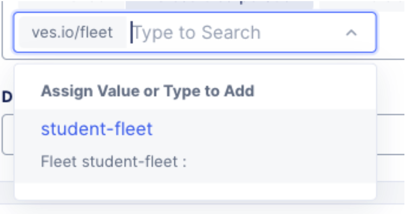

Click Cancel and Exit  

Go to site list, click on your CE animal name and click on tools on the far right. 
Click on Show Routes 

.. image:: ../images/showroutes.png

You can now use the access method on your ubuntu server to test ping. 

insert screenshots

Enhanced Firewall policy
---------------------------------

Observe that you can curl to the AWS machine on pot port 80 and port 8080. 

You will now =con figure thte F5 Distributed CLoud Enhanced Firewall to provide network security between these sites. 

Sanity Check
-------------
**This is what you just deployed.**

**End of Lab 1**

