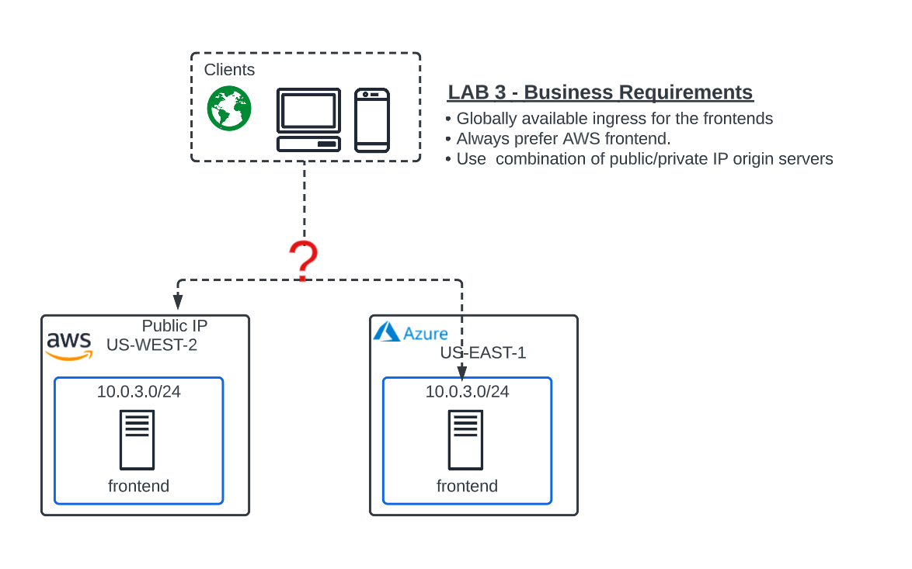
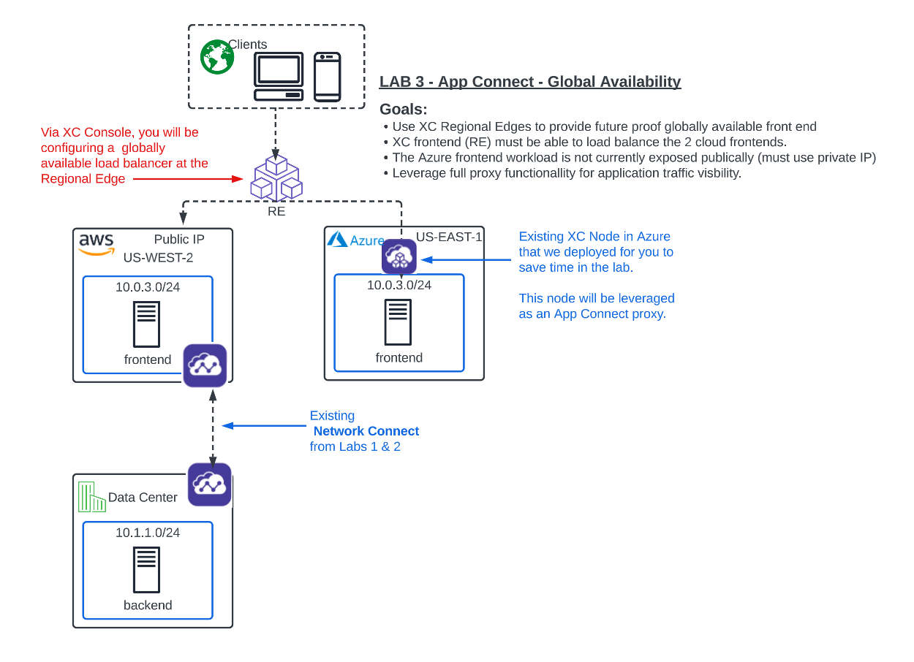
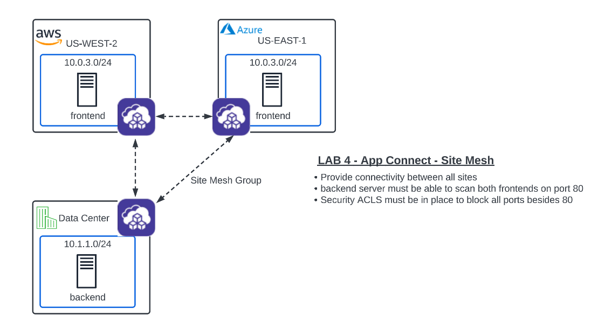

Lab 3: Globally Available Front End 
================================================
**Objective:**

*Use XC Regional Edges to provide future proof globally available frontend.

*XC frontend (RE) must be able to load balance the 2 cloud frontends. 

*Expose Azure private frontend without adding a public IP for it. 

*Always prefer the AWS frontend for ingress traffic. 

**What they want:**

**Narrative:**

Unfortunately, after doing your due diligence, you find that the Azure VNET overlaps with the AWS subnets. To make matters worse, 
the Azure server is not associated with any public IP and there is a security directive in place to not have any workload servers in Azure associated with a public IP. 
You think to yourself, this is going to be tricky, and reach out to your trusted F5 Solutions Engineer to see how this will work with Distributed Cloud. 

Your F5 Solutions Engineer explains that IP overlap between sites is a common problem and one that can be easily solved with Distributed Cloud App Connect. 
App Connect alleviates this problem by leveraging the XC Nodes as Software Defined proxies rather than SD Routers as they were configured with Network Connect.   

After reviewing the architecture with you, your Solutions Engineer advises you to break up these requirements in to 2 specific deliverables. 

**Deliverable 1:**

Create a globally scaled and future-proof frontend with the XC Regional Edges **(Lab 3)**

**Deliverable 2:**

Leverage App Connect to create a site mesh which will allow for secure site to site connectivity regardless of IP overlap. **(Lab 4)**

Regional Edge
~~~~~~~~~~~~~

A Regional Edge (RE) is part of Distributed Cloud Global Network that provides connectivity 
to services.  Previously when we deployed the UDF / AWS sites these were considered
"Customer Edge (CE)" and they make use of RE to communicate (each CE is associated with 
two RE).

Sanity Check
-------------
**This is what you just deployed.**

 

 

