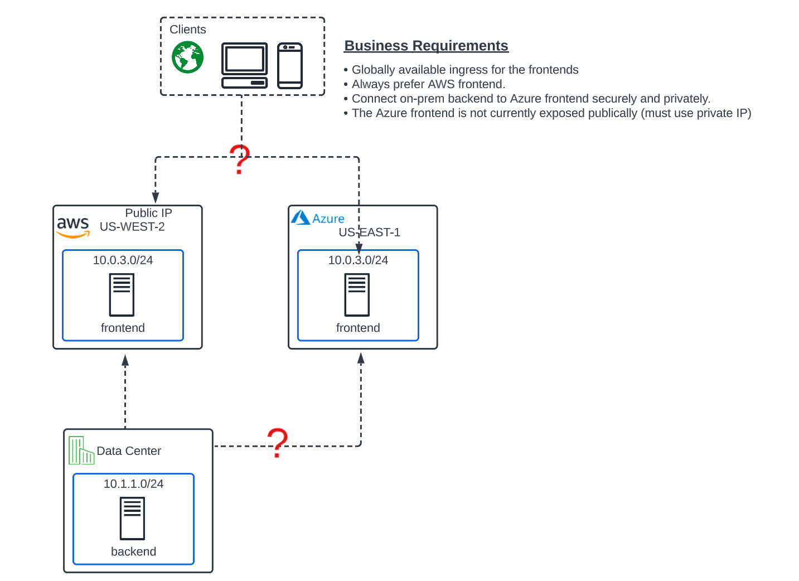
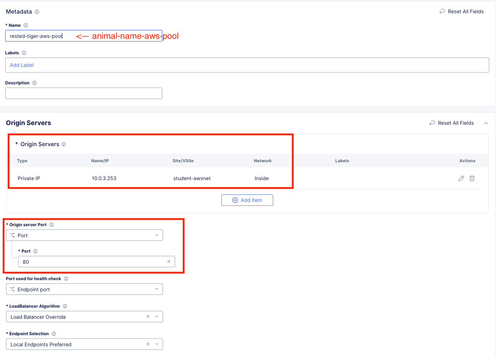
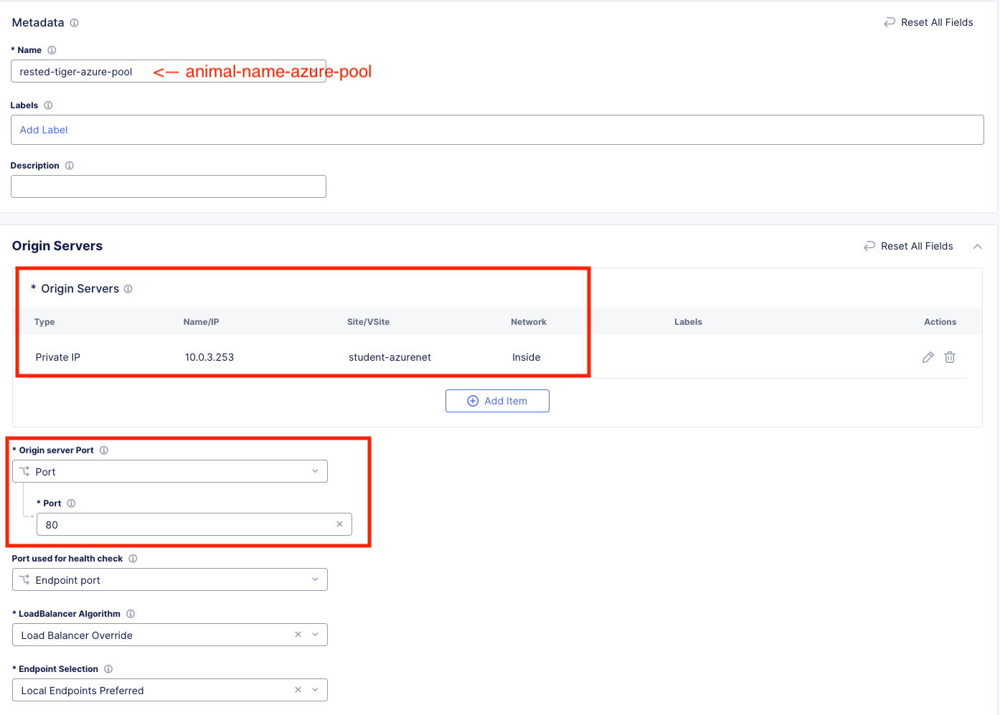

Lab 3: Globally Available Front End 
================================================
**Objective:**

*Use XC Regional Edges to provide future-proof, globally available frontend.

*XC frontend (RE) must be able to load balance the 2 cloud frontends. 

*Expose Azure private frontend without adding a public IP for the workload. 

*Always prefer the AWS frontend for ingress traffic. 

**What they want:**

**Narrative:**

Unfortunately, after doing your due diligence, you find that the Azure VNET overlaps with the AWS subnets. To make matters worse, 
the Azure server is not associated with any public IP and there is a security directive in place to not have any workload servers in Azure associated with a public IP without a security device. 

Lately the site has been getting pounded with traffic and frontend security has become a hot topic at ACME. 
You think to yourself, this is going to be tricky, and reach out to your trusted F5 Solutions Engineer to see how this will work with Distributed Cloud. 

Your F5 Solutions Engineer explains that IP overlap between sites is a common problem and one that can be easily solved with Distributed Cloud App Connect. 
App Connect alleviates this problem by leveraging the XC Nodes as Software Defined proxies rather than SD Routers as they were configured with Network Connect.

Also, you are informed that by using F5 Distributed Cloud Regional Edges for the frontend workloads, you will be able to have full proxy visibility and analytics for the client traffic so the Security team will be pleased. 

After reviewing the architecture with you, your Solutions Engineer advises you to break up these requirements in to 2 specific deliverables. 

**Deliverable 1:**

Create a globally scaled and future-proof frontend with the XC Regional Edges **(Lab 3)**

|

.. image:: ../images/lab3.png

|

**Deliverable 2:**

Leverage App Connect for secure site to site connectivity regardless of IP overlap. **(Lab 4)**

|

.. image:: ../images/lab4goal.png

|

Multi-Cloud App Connect
----------------------------

From the **Select service** menu, click on **Multi-Cloud App Connect** and then click on **Site List**.

Notice **your animal name** CE Node is available for App Connect configurations but shows a color status as Grey because of a Health Score of "Unused". Let's get an App Connect config going!

|

.. image:: ../images/appcsites.png

|

What does this really mean? 

With **Network Connect** you connected routed networks with your CE Node which acted as a SD-Router. 

Now with **App Connect** you will be configuring our Regional Edges and your CE Nodes as SD-Proxies to provide connectivity between workloads. The CE's can do both functions simultaneously!!  

In the **Side menu** under **Manage** click on **Load Balancers** >> **Origin Pools** and click the **Add Origin Pool** button. 

AWS Origin Pool
----------------

|

.. image:: ../images/orig.png

|

Enter the following Values:

==============================  =====
Variable                        Value
==============================  =====
Name                            animal-name-aws-pool
Origin Server Port              80
Origin Servers                  See Below 
==============================  =====

**Origin Servers:** Click **Add Item**

[NEED TO UPDATE TO USE PUBLIC IP TO FOLLOW LAB NARRATIVE]Use - http://public.lab.f5demos.com/

Hit the dropdown for **Select Type of Origin Server** and choose **IP Address of Origin Server on given Sites**. 

==============================  =====
Variable                        Value
==============================  =====
IP                              10.0.3.253
Origin Server Port              80
Site or Virtual Site            Site
Site:                           **system/student-awsnet**
Select Network on the site      Inside Network
==============================  =====

Click **Apply**. 

Your config should look like this: 

|

|

Leave everything else as **default** and click **Save and Exit**.

Azure Origin Pool
---------------------

Click the **Add Origin Pool** button at the top the screen. 

==============================  =====
Variable                        Value
==============================  =====
Name                            animal-name-azure-pool
Origin Server Port              80
Origin Servers                  See Below 
==============================  =====

Hit the dropdown for **Select Type of Origin Server** and choose **IP Address of Origin Server on given Sites**. 

==============================  =====
Variable                        Value
==============================  =====
IP                              10.0.3.253 (Note: this is not a typo. The CSP workloads have IP overlap)
Origin Server Port              80
Site or Virtual Site            Site
Site:                           **system/student-azurenet**
Select Network on the site      Inside Network
==============================  =====

Click **Apply**. 

Your config should look like this: 

|

|

Leave everything else as **default** and click **Save and Exit**.

Now that we have defined our Origin Server pools which are overlapping private IP workloads in AWS and Azure, we will set up the App Connect Proxy to provide a Global Frontend.

Global Frontend
----------------------------

In the **Side menu** under **Manage** click on **Load Balancers** >> **HTTP Load Balancers** and click the **Add HTTP Load Balancer** button. 

==================================    =====
Variable                              Value
==================================    =====
Name                                  animal-name-acme-frontend
Domains and LB Type                   animal-name-acme-frontend.lab-mcn.f5demos.com
Load Balancer Type                    HTTP
Automatically Manage DNS Records      **check**
HTTP Port                             80
Origin Pools                          See Below 
==================================    =====

**Origin Pools**

Click **Add Item** and under "Origin Pool" select the **AWS pool** with your animal name. Leave everything else as **default** and click **Apply**.

|

.. image:: ../images/awspri.png

|

Click **Add Item** again and under "Origin Pool" select the **Azure pool** with your animal name. This time, change the priority to **0** and click **Apply**.

.. Note:: A zero value priority makes that pool the lowest priority. A value of **1** is the highest priority. AWS was set to **1** by default. 

|

.. image:: ../images/azurepri.png

|

Click **Apply** and you should now be back to the **HTTP Load Balancer** configuration screen which should look like this. 

|

.. image:: ../images/httplb.png

|

Leave everything else as **default** and scroll down to the bottom to click **Save and Exit**.

You should now see your Globally Available frontend in the **HTTP Load Balancers** screen.

|

.. image:: ../images/newlb.png

|

Go ahead and open up a **Command Prompt** or **Terminal** on your personal machine and type the following command: 

**nslookup [animal-name]-acme-frontend.lab-msc.f5demos.com** and note the IP address that is returned. 

In my example, I am using a terminal on MAC and my animal-name was **rested-tiger**.

|

.. image:: ../images/nslookup.png

|

Now open up a new tab in your browser and try http://[animal-name]-acme-frontend.lab-msc.f5demos.com

TODO
[INSERT screenshots of aws site and section about analytics]
[Add healthcheck to origin pools or priority failover doesnt occur.]
[Change AWS pool healthcheck to enable TLS to force failover]

Sanity Check
-------------
**This is what you just deployed.**

|

.. image:: ../images/lab3review.png

|

 

 

