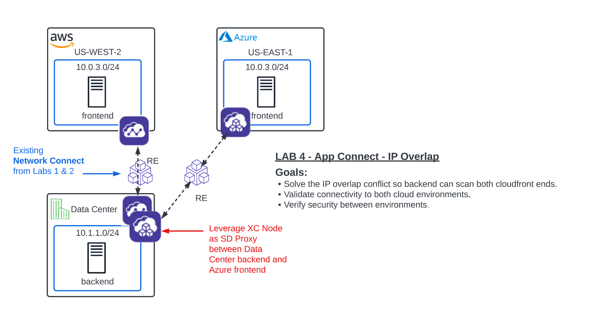

Lab 4: App Connect - Solving IP Overlap 
===========================================

**Objective:**

*Implement App Connect to overcome IP Address overlap in AWS/Azure.  

*Provide private and secure connectivity between all sites. 

*Configure policy to only permit port 80 between these sites. 

*Review network security events in the XC console.

|

.. image:: ../images/lab4bizreq1.png

|

**Narrative:** 

Now that the globally available frontend has been deployed, it's time to start working on **Deliverable #2** and configure backend connectivity. Since Network Connect does **NOT** support IP overlap, we will configure the XC Nodes with App Connect proxies. 
Recall that Network Connect, connects networks by using the XC Nodes as SD Routers and App Connect uses the XC Nodes as SD Proxies to connect applications. 

|

|

Multi-Cloud App Connect
----------------------------

In the **Side menu** under **Manage** click on **Load Balancers** >> **HTTP Load Balancers** and click the **Add HTTP Load Balancer** button. 

Enter the following values:

==================================      ==============
Variable                                Value
==================================      ==============
Name                                    animal-name-backend-vip-to-azure
Domains and LB Type                     animal-name-backend-vip-to-azure.lab-mcn.f5demos.com
Load Balancer Type                      HTTP
Automatically Manage DNS Records        **uncheck**
HTTP Port                               80
Origin Pools                            See Below 
==================================      ==============

**Origin Pools**

Click **Add Item** and under "Origin Pool" select the **Azure pool** with your animal name. 

Your config should look like this so far: 

|

.. image:: ../images/backendvip.png

|

**Scroll** all the way down until you reach the **Other Settings** section. Here you will find the **VIP Advertisement** field. 

.. Important:: In the previous lab, we took the default of **Internet** here. This means that the load balancer will be distributed across all Regional Edges in our anycast network. This time we will choose our Data Ceneter CE to host the load balancer.

Hit the dropdown and select **Custom**. 

|

.. image:: ../images/custom.png

|

Now click the **Configure** link right below that field: 

|

.. image:: ../images/configure.png

|

On the **"List of Sites to Advertise"** screen click **Add Item**. 

Enter the following values:

==============================    =========================================================
Variable                          Value
==============================    =========================================================
Select Where to Advertise         Site
Site Network                      [animal-name]-backend-vip-to-azure.lab-mcn.f5demos.com
Site Reference                    system/[animal-name]
TCP Listen Port Choice            Leave default
==============================    =========================================================

Click on **Apply** and then **Save and Exit** on the main **HTTP Load Balancer** config screen. 

[TEST from Ubuntu to vip not working curl http://10.1.1.5 ]
[Saw denies in CE Flow table log from previous lab so tried removing fwp but still not working]
[tried removing CE from fleet still not working]
[No stats showng up on lb in XCConsole]

root@ubuntu:/# curl http://10.1.1.5
<html><head><title>Error Page</title></head>
<body>The requested URL was rejected. Please consult with your administrator.  
Your support ID is c70e3bcc-dd07-467b-a2c1-cbefefd0080c<h2>Error 404 - Not Found</h2>F5 site: rested-tiger  <a href='javascript:history.back();'>[Go Back]</a></body></html>

Sanity Check
-------------
**This is what you just deployed.**

**We hope you enjoyed this lab!**

**End of Lab 4**
