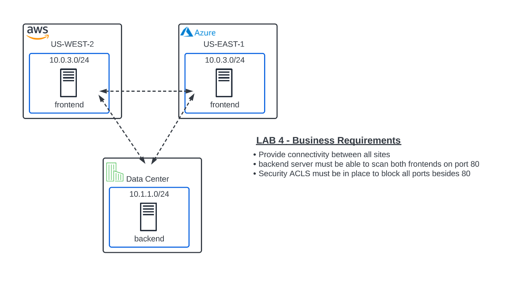
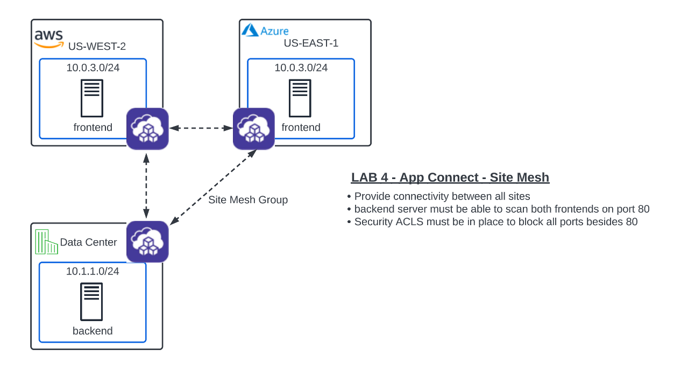

Lab 4: App Connect - Solving IP Overlap 
===========================================

**Objective:**

*Implement App Connect to overcome IP Address overlap in AWS/Azure.  

*Provide private and secure connectivity between all sites. 

*Configure policy to only permit port 80 between these sites. 

*Review network security events in the XC console.

**Narrative:** 

Now that the globally available frontend has been deployed, it's time to start working on **Deliverable #2** and configure connectivity between the three
environments. Since Network Connect does **NOT** support IP overlap, we will configure the XC Nodes with App Connect. 
Recall from the lecture that Network connect, connects networks by using the XC Nodes as SD Routers and App Connect uses the XC Nodes as SD Proxies to connect applications. 

Thank you for completing the lab!

