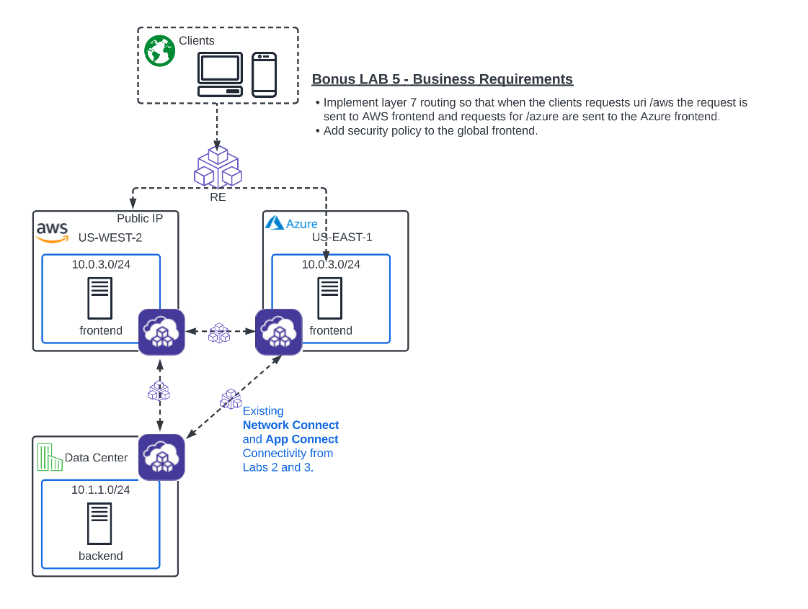
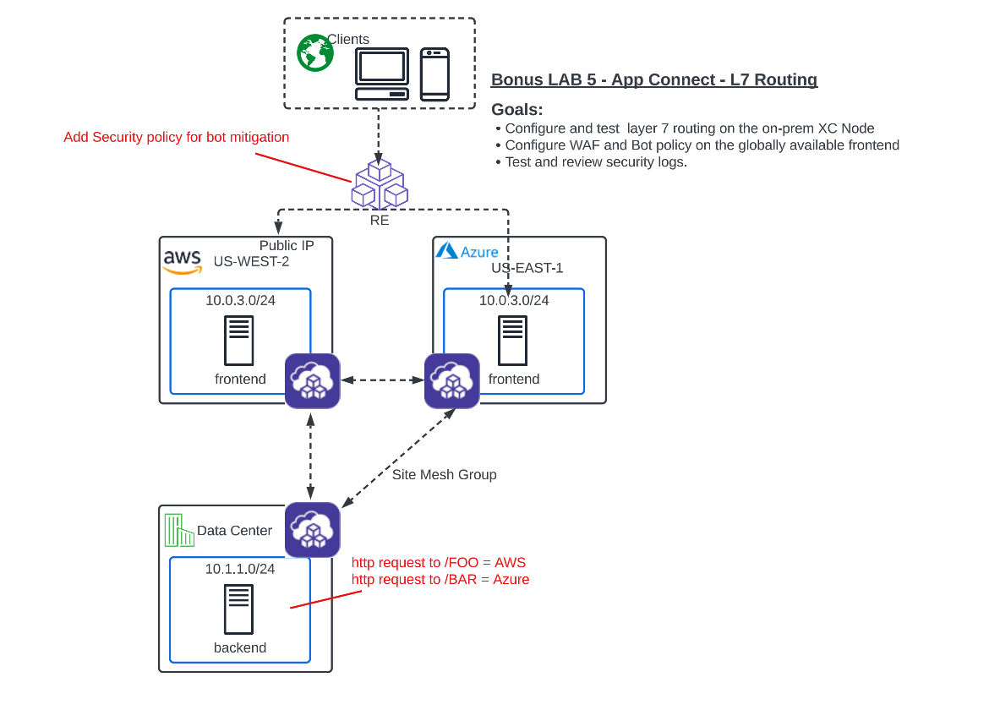

Lab 5: Bonus Lab - L7 AppRouting  
================================

**Objective:**

*Configure security policy to protect the frontends from manual and automated web attacks.  

*Configure the backend App Proxy to perform Layer 7 routing.

*Test connectivity and verify security.

*Review application security events in the XC console.

**Narrative:** 
Much like "The Real World" the requirements never stop coming. Now, ACME has 2 new deliverables for you to figure out. First, ever since exposing the frontends globally, they have noticed 
alot of automated aka bot traffic coming in to their application. They have asked if there is a way to apply security policy to identify and remediate the bots as well as manual attacks. 

Second, the backend security device now needs to communicate to AWS and Azure based on URI. The requirement is for any requests from the backend that have /FOO in the URI should be routed to AWS. 
Any requests with /BAR should be routed to Azure. 

